```python
import pandas as pd
import numpy as np
import seaborn as sns
import matplotlib.pyplot as plt
```

Do EDD of the movie dataset and list down you observations


```python
d1 = pd.read_csv('Movie_collection.csv')
```


```python
d1.head()
```


<div>
<style scoped>
    .dataframe tbody tr th:only-of-type {
        vertical-align: middle;
    }

    .dataframe tbody tr th {
        vertical-align: top;
    }

    .dataframe thead th {
        text-align: right;
    }
</style>
<table border="1" class="dataframe">
  <thead>
    <tr style="text-align: right;">
      <th></th>
      <th>Collection</th>
      <th>Marketing expense</th>
      <th>Production expense</th>
      <th>Multiplex coverage</th>
      <th>Budget</th>
      <th>Movie_length</th>
      <th>Lead_ Actor_Rating</th>
      <th>Lead_Actress_rating</th>
      <th>Director_rating</th>
      <th>Producer_rating</th>
      <th>Critic_rating</th>
      <th>Trailer_views</th>
      <th>3D_available</th>
      <th>Time_taken</th>
      <th>Twitter_hastags</th>
      <th>Genre</th>
      <th>Avg_age_actors</th>
      <th>MPAA_film_rating</th>
      <th>Num_multiplex</th>
      <th>Start_Tech_Oscar</th>
    </tr>
  </thead>
  <tbody>
    <tr>
      <th>0</th>
      <td>48000</td>
      <td>20.1264</td>
      <td>59.62</td>
      <td>0.462</td>
      <td>36524.125</td>
      <td>138.7</td>
      <td>7.825</td>
      <td>8.095</td>
      <td>7.910</td>
      <td>7.995</td>
      <td>7.94</td>
      <td>527367</td>
      <td>YES</td>
      <td>109.60</td>
      <td>223.840</td>
      <td>Thriller</td>
      <td>23</td>
      <td>PG</td>
      <td>494</td>
      <td>0</td>
    </tr>
    <tr>
      <th>1</th>
      <td>43200</td>
      <td>20.5462</td>
      <td>69.14</td>
      <td>0.531</td>
      <td>35668.655</td>
      <td>152.4</td>
      <td>7.505</td>
      <td>7.650</td>
      <td>7.440</td>
      <td>7.470</td>
      <td>7.44</td>
      <td>494055</td>
      <td>NO</td>
      <td>146.64</td>
      <td>243.456</td>
      <td>Drama</td>
      <td>42</td>
      <td>PG</td>
      <td>462</td>
      <td>1</td>
    </tr>
    <tr>
      <th>2</th>
      <td>69400</td>
      <td>20.5458</td>
      <td>69.14</td>
      <td>0.531</td>
      <td>39912.675</td>
      <td>134.6</td>
      <td>7.485</td>
      <td>7.570</td>
      <td>7.495</td>
      <td>7.515</td>
      <td>7.44</td>
      <td>547051</td>
      <td>NO</td>
      <td>147.88</td>
      <td>2022.400</td>
      <td>Comedy</td>
      <td>38</td>
      <td>PG</td>
      <td>458</td>
      <td>0</td>
    </tr>
    <tr>
      <th>3</th>
      <td>66800</td>
      <td>20.6474</td>
      <td>59.36</td>
      <td>0.542</td>
      <td>38873.890</td>
      <td>119.3</td>
      <td>6.895</td>
      <td>7.035</td>
      <td>6.920</td>
      <td>7.020</td>
      <td>8.26</td>
      <td>516279</td>
      <td>YES</td>
      <td>185.36</td>
      <td>225.344</td>
      <td>Drama</td>
      <td>45</td>
      <td>PG</td>
      <td>472</td>
      <td>0</td>
    </tr>
    <tr>
      <th>4</th>
      <td>72400</td>
      <td>21.3810</td>
      <td>59.36</td>
      <td>0.542</td>
      <td>39701.585</td>
      <td>127.7</td>
      <td>6.920</td>
      <td>7.070</td>
      <td>6.815</td>
      <td>7.070</td>
      <td>8.26</td>
      <td>531448</td>
      <td>NO</td>
      <td>176.48</td>
      <td>225.792</td>
      <td>Drama</td>
      <td>55</td>
      <td>PG</td>
      <td>395</td>
      <td>0</td>
    </tr>
  </tbody>
</table>
</div>


```python
d1.shape
```


    (506, 20)


```python
d1.describe()
```


<div>
<style scoped>
    .dataframe tbody tr th:only-of-type {
        vertical-align: middle;
    }

    .dataframe tbody tr th {
        vertical-align: top;
    }

    .dataframe thead th {
        text-align: right;
    }
</style>
<table border="1" class="dataframe">
  <thead>
    <tr style="text-align: right;">
      <th></th>
      <th>Collection</th>
      <th>Marketing expense</th>
      <th>Production expense</th>
      <th>Multiplex coverage</th>
      <th>Budget</th>
      <th>Movie_length</th>
      <th>Lead_ Actor_Rating</th>
      <th>Lead_Actress_rating</th>
      <th>Director_rating</th>
      <th>Producer_rating</th>
      <th>Critic_rating</th>
      <th>Trailer_views</th>
      <th>Time_taken</th>
      <th>Twitter_hastags</th>
      <th>Avg_age_actors</th>
      <th>Num_multiplex</th>
      <th>Start_Tech_Oscar</th>
    </tr>
  </thead>
  <tbody>
    <tr>
      <th>count</th>
      <td>506.000000</td>
      <td>506.000000</td>
      <td>506.000000</td>
      <td>506.000000</td>
      <td>506.000000</td>
      <td>506.000000</td>
      <td>506.000000</td>
      <td>506.000000</td>
      <td>506.000000</td>
      <td>506.000000</td>
      <td>506.000000</td>
      <td>506.000000</td>
      <td>494.000000</td>
      <td>506.000000</td>
      <td>506.000000</td>
      <td>506.000000</td>
      <td>506.000000</td>
    </tr>
    <tr>
      <th>mean</th>
      <td>45057.707510</td>
      <td>92.270471</td>
      <td>77.273557</td>
      <td>0.445305</td>
      <td>34911.144022</td>
      <td>142.074901</td>
      <td>8.014002</td>
      <td>8.185613</td>
      <td>8.019664</td>
      <td>8.190514</td>
      <td>7.810870</td>
      <td>449860.715415</td>
      <td>157.391498</td>
      <td>260.832095</td>
      <td>39.181818</td>
      <td>545.043478</td>
      <td>0.454545</td>
    </tr>
    <tr>
      <th>std</th>
      <td>18364.351764</td>
      <td>172.030902</td>
      <td>13.720706</td>
      <td>0.115878</td>
      <td>3903.038232</td>
      <td>28.148861</td>
      <td>1.054266</td>
      <td>1.054290</td>
      <td>1.059899</td>
      <td>1.049601</td>
      <td>0.659699</td>
      <td>68917.763145</td>
      <td>31.295161</td>
      <td>104.779133</td>
      <td>12.513697</td>
      <td>106.332889</td>
      <td>0.498422</td>
    </tr>
    <tr>
      <th>min</th>
      <td>10000.000000</td>
      <td>20.126400</td>
      <td>55.920000</td>
      <td>0.129000</td>
      <td>19781.355000</td>
      <td>76.400000</td>
      <td>3.840000</td>
      <td>4.035000</td>
      <td>3.840000</td>
      <td>4.030000</td>
      <td>6.600000</td>
      <td>212912.000000</td>
      <td>0.000000</td>
      <td>201.152000</td>
      <td>3.000000</td>
      <td>333.000000</td>
      <td>0.000000</td>
    </tr>
    <tr>
      <th>25%</th>
      <td>34050.000000</td>
      <td>21.640900</td>
      <td>65.380000</td>
      <td>0.376000</td>
      <td>32693.952500</td>
      <td>118.525000</td>
      <td>7.316250</td>
      <td>7.503750</td>
      <td>7.296250</td>
      <td>7.507500</td>
      <td>7.200000</td>
      <td>409128.000000</td>
      <td>132.300000</td>
      <td>223.796000</td>
      <td>28.000000</td>
      <td>465.000000</td>
      <td>0.000000</td>
    </tr>
    <tr>
      <th>50%</th>
      <td>42400.000000</td>
      <td>25.130200</td>
      <td>74.380000</td>
      <td>0.462000</td>
      <td>34488.217500</td>
      <td>151.000000</td>
      <td>8.307500</td>
      <td>8.495000</td>
      <td>8.312500</td>
      <td>8.465000</td>
      <td>7.960000</td>
      <td>462460.000000</td>
      <td>160.000000</td>
      <td>254.400000</td>
      <td>39.000000</td>
      <td>535.500000</td>
      <td>0.000000</td>
    </tr>
    <tr>
      <th>75%</th>
      <td>50000.000000</td>
      <td>93.541650</td>
      <td>91.200000</td>
      <td>0.551000</td>
      <td>36793.542500</td>
      <td>167.575000</td>
      <td>8.865000</td>
      <td>9.030000</td>
      <td>8.883750</td>
      <td>9.030000</td>
      <td>8.260000</td>
      <td>500247.500000</td>
      <td>181.890000</td>
      <td>283.416000</td>
      <td>50.000000</td>
      <td>614.750000</td>
      <td>1.000000</td>
    </tr>
    <tr>
      <th>max</th>
      <td>100000.000000</td>
      <td>1799.524000</td>
      <td>110.480000</td>
      <td>0.615000</td>
      <td>48772.900000</td>
      <td>173.500000</td>
      <td>9.435000</td>
      <td>9.540000</td>
      <td>9.425000</td>
      <td>9.635000</td>
      <td>9.400000</td>
      <td>567784.000000</td>
      <td>217.520000</td>
      <td>2022.400000</td>
      <td>60.000000</td>
      <td>868.000000</td>
      <td>1.000000</td>
    </tr>
  </tbody>
</table>
</div>


```python
d1.rename(columns={'Marketing expense':'Marketing_expense'},inplace=True)
```


```python
d1.isna().sum()
```


    Collection              0
    Marketing_expense       0
    Production expense      0
    Multiplex coverage      0
    Budget                  0
    Movie_length            0
    Lead_ Actor_Rating      0
    Lead_Actress_rating     0
    Director_rating         0
    Producer_rating         0
    Critic_rating           0
    Trailer_views           0
    3D_available            0
    Time_taken             12
    Twitter_hastags         0
    Genre                   0
    Avg_age_actors          0
    MPAA_film_rating        0
    Num_multiplex           0
    Start_Tech_Oscar        0
    dtype: int64


Impute the missing values in the movie dataset. Use a value of your
choice (mean/ median) to replace the missing values.


```python
d1['Time_taken']=d1['Time_taken'].fillna(d1['Time_taken'].median())
```


```python
d1.isna().sum()
```


    Collection             0
    Marketing_expense      0
    Production expense     0
    Multiplex coverage     0
    Budget                 0
    Movie_length           0
    Lead_ Actor_Rating     0
    Lead_Actress_rating    0
    Director_rating        0
    Producer_rating        0
    Critic_rating          0
    Trailer_views          0
    3D_available           0
    Time_taken             0
    Twitter_hastags        0
    Genre                  0
    Avg_age_actors         0
    MPAA_film_rating       0
    Num_multiplex          0
    Start_Tech_Oscar       0
    dtype: int64


Treat the outliers in the movie dataset. Use upper and lower boundaries
of your choice to limit the outlying values.


```python
sns.boxplot(y='Marketing_expense', data=d1)
```


    <AxesSubplot:ylabel='Marketing_expense'>


    
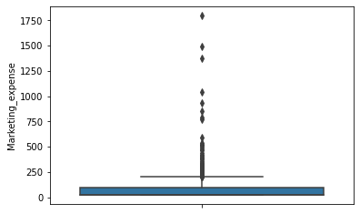
    


```python
uv=np.percentile(d1.Marketing_expense,[99][0])
```


```python
uv
```


    847.4065999999992


```python
d1.Marketing_expense[(d1.Marketing_expense > 1.5* uv)]= 1.5* uv
```

    C:\Users\HOME\AppData\Local\Temp\ipykernel_2056\3844923783.py:1: SettingWithCopyWarning: 
    A value is trying to be set on a copy of a slice from a DataFrame
    
    See the caveats in the documentation: https://pandas.pydata.org/pandas-docs/stable/user_guide/indexing.html#returning-a-view-versus-a-copy
      d1.Marketing_expense[(d1.Marketing_expense > 1.5* uv)]= 1.5* uv
    


```python
sns.boxplot(y='Marketing_expense', data=d1)
```


    <AxesSubplot:ylabel='Marketing_expense'>


    
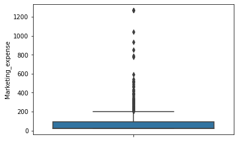
    


```python
sns.boxplot(y="Time_taken", data=d1)
```


    <AxesSubplot:ylabel='Time_taken'>


    
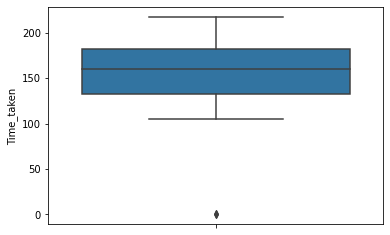
    


```python
lv=np.percentile(d1.Time_taken,[1])[0]
```


```python
lv
```


    106.75


```python
d1.Time_taken[(d1.Time_taken <0.3*lv)]=0.3*lv
```

    C:\Users\HOME\AppData\Local\Temp\ipykernel_2056\257084932.py:1: SettingWithCopyWarning: 
    A value is trying to be set on a copy of a slice from a DataFrame
    
    See the caveats in the documentation: https://pandas.pydata.org/pandas-docs/stable/user_guide/indexing.html#returning-a-view-versus-a-copy
      d1.Time_taken[(d1.Time_taken <0.3*lv)]=0.3*lv
    


```python
sns.boxplot(y="Num_multiplex", data=d1)
```


    <AxesSubplot:ylabel='Num_multiplex'>


    
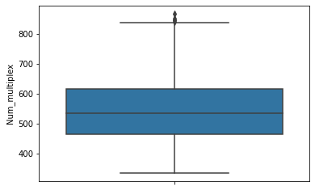
    


```python
uv1=np.percentile(d1['Num_multiplex'],[99][0])
```


```python
d1.Num_multiplex[(d1.Num_multiplex > 1*uv1)]= 1* uv1
```

    C:\Users\HOME\AppData\Local\Temp\ipykernel_2056\1536549823.py:1: SettingWithCopyWarning: 
    A value is trying to be set on a copy of a slice from a DataFrame
    
    See the caveats in the documentation: https://pandas.pydata.org/pandas-docs/stable/user_guide/indexing.html#returning-a-view-versus-a-copy
      d1.Num_multiplex[(d1.Num_multiplex > 1*uv1)]= 1* uv1
    


```python
sns.boxplot(y="Budget", data=d1)
```


    <AxesSubplot:ylabel='Budget'>


    
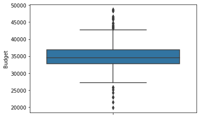
    


```python
uv3=np.percentile(d1.Budget,[99][0])
```


```python
d1.Budget[(d1.Budget>3*uv3)]= 3*uv3
```

    C:\Users\HOME\AppData\Local\Temp\ipykernel_2056\3456189797.py:1: SettingWithCopyWarning: 
    A value is trying to be set on a copy of a slice from a DataFrame
    
    See the caveats in the documentation: https://pandas.pydata.org/pandas-docs/stable/user_guide/indexing.html#returning-a-view-versus-a-copy
      d1.Budget[(d1.Budget>3*uv3)]= 3*uv3
    


```python
lv1=np.percentile(d1.Budget,[1])[0]
```


```python
d1.Budget[(d1.Budget<0.3*lv1)]=0.3*lv1
```

    C:\Users\HOME\AppData\Local\Temp\ipykernel_2056\2056264507.py:1: SettingWithCopyWarning: 
    A value is trying to be set on a copy of a slice from a DataFrame
    
    See the caveats in the documentation: https://pandas.pydata.org/pandas-docs/stable/user_guide/indexing.html#returning-a-view-versus-a-copy
      d1.Budget[(d1.Budget<0.3*lv1)]=0.3*lv1
    


```python
d1.rename(columns={'Lead_ Actor_Rating':'Lead_Actor_Rating'},inplace=True)
```


```python
sns.boxplot(y="Lead_Actor_Rating", data=d1)
```


    <AxesSubplot:ylabel='Lead_Actor_Rating'>


    
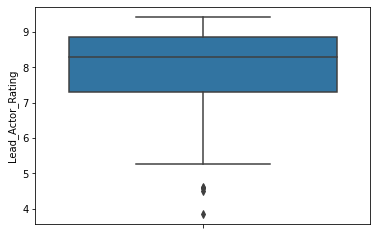
    


```python
lv2=np.percentile(d1.Lead_Actor_Rating,[1])[0]
```


```python
d1.Lead_Actor_Rating[(d1.Lead_Actor_Rating<0.3*lv2)]=0.3*lv2
```

    C:\Users\HOME\AppData\Local\Temp\ipykernel_2056\2712452891.py:1: SettingWithCopyWarning: 
    A value is trying to be set on a copy of a slice from a DataFrame
    
    See the caveats in the documentation: https://pandas.pydata.org/pandas-docs/stable/user_guide/indexing.html#returning-a-view-versus-a-copy
      d1.Lead_Actor_Rating[(d1.Lead_Actor_Rating<0.3*lv2)]=0.3*lv2
    


```python
sns.boxplot(y="Lead_Actress_rating", data=d1)
```


    <AxesSubplot:ylabel='Lead_Actress_rating'>


    
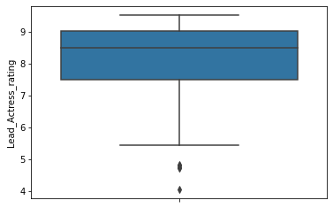
    


```python
lv3=np.percentile(d1.Lead_Actress_rating,[1])[0]
```


```python
d1.Lead_Actress_rating[(d1.Lead_Actress_rating<0.3*lv3)]=0.3*lv3
```

    C:\Users\HOME\AppData\Local\Temp\ipykernel_2056\450974775.py:1: SettingWithCopyWarning: 
    A value is trying to be set on a copy of a slice from a DataFrame
    
    See the caveats in the documentation: https://pandas.pydata.org/pandas-docs/stable/user_guide/indexing.html#returning-a-view-versus-a-copy
      d1.Lead_Actress_rating[(d1.Lead_Actress_rating<0.3*lv3)]=0.3*lv3
    


```python
sns.boxplot(y="Director_rating", data=d1)
```


    <AxesSubplot:ylabel='Director_rating'>


    
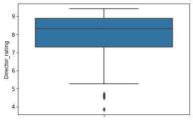
    


```python
lv4=np.percentile(d1.Director_rating,[1])[0]
```


```python
d1.Director_rating[(d1.Director_rating<0.3*lv4)]=0.3*lv4
```

    C:\Users\HOME\AppData\Local\Temp\ipykernel_2056\2639440227.py:1: SettingWithCopyWarning: 
    A value is trying to be set on a copy of a slice from a DataFrame
    
    See the caveats in the documentation: https://pandas.pydata.org/pandas-docs/stable/user_guide/indexing.html#returning-a-view-versus-a-copy
      d1.Director_rating[(d1.Director_rating<0.3*lv4)]=0.3*lv4
    


```python
sns.boxplot(y="Producer_rating", data=d1)
```


    <AxesSubplot:ylabel='Producer_rating'>


    
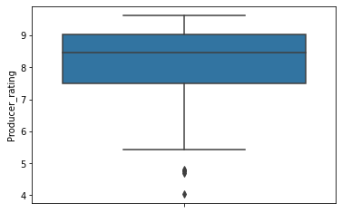
    


```python
lv5=np.percentile(d1.Producer_rating,[1])[0]
```


```python
d1.Producer_rating[(d1.Producer_rating<0.3*lv5)]=0.3*lv5
```

    C:\Users\HOME\AppData\Local\Temp\ipykernel_2056\1990302295.py:1: SettingWithCopyWarning: 
    A value is trying to be set on a copy of a slice from a DataFrame
    
    See the caveats in the documentation: https://pandas.pydata.org/pandas-docs/stable/user_guide/indexing.html#returning-a-view-versus-a-copy
      d1.Producer_rating[(d1.Producer_rating<0.3*lv5)]=0.3*lv5
    


```python
sns.boxplot(y="Trailer_views", data=d1)
```


    <AxesSubplot:ylabel='Trailer_views'>


    
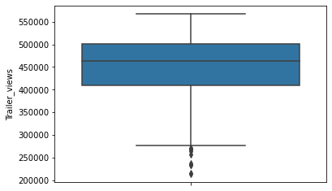
    


```python
lv6=np.percentile(d1.Trailer_views,[1])[0]
```


```python
d1.Trailer_views[(d1.Trailer_views<0.1*lv6)]=0.1*lv6
```

    C:\Users\HOME\AppData\Local\Temp\ipykernel_2056\4095575281.py:1: SettingWithCopyWarning: 
    A value is trying to be set on a copy of a slice from a DataFrame
    
    See the caveats in the documentation: https://pandas.pydata.org/pandas-docs/stable/user_guide/indexing.html#returning-a-view-versus-a-copy
      d1.Trailer_views[(d1.Trailer_views<0.1*lv6)]=0.1*lv6
    


```python
sns.boxplot(y="Twitter_hastags", data=d1)
```


    <AxesSubplot:ylabel='Twitter_hastags'>


    
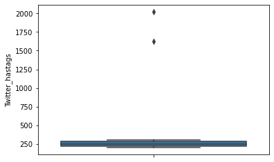
    


```python
uv4=np.percentile(d1.Twitter_hastags,[99][0])
```


```python
d1.Twitter_hastags[(d1.Twitter_hastags>1.5*uv4)]= 1.5*uv4
```

    C:\Users\HOME\AppData\Local\Temp\ipykernel_2056\2127863932.py:1: SettingWithCopyWarning: 
    A value is trying to be set on a copy of a slice from a DataFrame
    
    See the caveats in the documentation: https://pandas.pydata.org/pandas-docs/stable/user_guide/indexing.html#returning-a-view-versus-a-copy
      d1.Twitter_hastags[(d1.Twitter_hastags>1.5*uv4)]= 1.5*uv4
    


```python
d1.describe()
```


<div>
<style scoped>
    .dataframe tbody tr th:only-of-type {
        vertical-align: middle;
    }

    .dataframe tbody tr th {
        vertical-align: top;
    }

    .dataframe thead th {
        text-align: right;
    }
</style>
<table border="1" class="dataframe">
  <thead>
    <tr style="text-align: right;">
      <th></th>
      <th>Collection</th>
      <th>Marketing_expense</th>
      <th>Production expense</th>
      <th>Multiplex coverage</th>
      <th>Budget</th>
      <th>Movie_length</th>
      <th>Lead_Actor_Rating</th>
      <th>Lead_Actress_rating</th>
      <th>Director_rating</th>
      <th>Producer_rating</th>
      <th>Critic_rating</th>
      <th>Trailer_views</th>
      <th>Time_taken</th>
      <th>Twitter_hastags</th>
      <th>Avg_age_actors</th>
      <th>Num_multiplex</th>
      <th>Start_Tech_Oscar</th>
    </tr>
  </thead>
  <tbody>
    <tr>
      <th>count</th>
      <td>506.000000</td>
      <td>506.000000</td>
      <td>506.000000</td>
      <td>506.000000</td>
      <td>506.000000</td>
      <td>506.000000</td>
      <td>506.000000</td>
      <td>506.000000</td>
      <td>506.000000</td>
      <td>506.000000</td>
      <td>506.000000</td>
      <td>506.000000</td>
      <td>506.000000</td>
      <td>506.000000</td>
      <td>506.000000</td>
      <td>506.000000</td>
      <td>506.000000</td>
    </tr>
    <tr>
      <th>mean</th>
      <td>45057.707510</td>
      <td>90.580170</td>
      <td>77.273557</td>
      <td>0.445305</td>
      <td>34911.144022</td>
      <td>142.074901</td>
      <td>8.014002</td>
      <td>8.185613</td>
      <td>8.019664</td>
      <td>8.190514</td>
      <td>7.810870</td>
      <td>449860.715415</td>
      <td>157.579941</td>
      <td>255.454963</td>
      <td>39.181818</td>
      <td>544.855336</td>
      <td>0.454545</td>
    </tr>
    <tr>
      <th>std</th>
      <td>18364.351764</td>
      <td>157.884471</td>
      <td>13.720706</td>
      <td>0.115878</td>
      <td>3903.038232</td>
      <td>28.148861</td>
      <td>1.054266</td>
      <td>1.054290</td>
      <td>1.059899</td>
      <td>1.049601</td>
      <td>0.659699</td>
      <td>68917.763145</td>
      <td>30.337731</td>
      <td>35.973951</td>
      <td>12.513697</td>
      <td>105.804749</td>
      <td>0.498422</td>
    </tr>
    <tr>
      <th>min</th>
      <td>10000.000000</td>
      <td>20.126400</td>
      <td>55.920000</td>
      <td>0.129000</td>
      <td>19781.355000</td>
      <td>76.400000</td>
      <td>3.840000</td>
      <td>4.035000</td>
      <td>3.840000</td>
      <td>4.030000</td>
      <td>6.600000</td>
      <td>212912.000000</td>
      <td>32.025000</td>
      <td>201.152000</td>
      <td>3.000000</td>
      <td>333.000000</td>
      <td>0.000000</td>
    </tr>
    <tr>
      <th>25%</th>
      <td>34050.000000</td>
      <td>21.640900</td>
      <td>65.380000</td>
      <td>0.376000</td>
      <td>32693.952500</td>
      <td>118.525000</td>
      <td>7.316250</td>
      <td>7.503750</td>
      <td>7.296250</td>
      <td>7.507500</td>
      <td>7.200000</td>
      <td>409128.000000</td>
      <td>132.690000</td>
      <td>223.796000</td>
      <td>28.000000</td>
      <td>465.000000</td>
      <td>0.000000</td>
    </tr>
    <tr>
      <th>50%</th>
      <td>42400.000000</td>
      <td>25.130200</td>
      <td>74.380000</td>
      <td>0.462000</td>
      <td>34488.217500</td>
      <td>151.000000</td>
      <td>8.307500</td>
      <td>8.495000</td>
      <td>8.312500</td>
      <td>8.465000</td>
      <td>7.960000</td>
      <td>462460.000000</td>
      <td>160.000000</td>
      <td>254.400000</td>
      <td>39.000000</td>
      <td>535.500000</td>
      <td>0.000000</td>
    </tr>
    <tr>
      <th>75%</th>
      <td>50000.000000</td>
      <td>93.541650</td>
      <td>91.200000</td>
      <td>0.551000</td>
      <td>36793.542500</td>
      <td>167.575000</td>
      <td>8.865000</td>
      <td>9.030000</td>
      <td>8.883750</td>
      <td>9.030000</td>
      <td>8.260000</td>
      <td>500247.500000</td>
      <td>181.520000</td>
      <td>283.416000</td>
      <td>50.000000</td>
      <td>614.750000</td>
      <td>1.000000</td>
    </tr>
    <tr>
      <th>max</th>
      <td>100000.000000</td>
      <td>1271.109900</td>
      <td>110.480000</td>
      <td>0.615000</td>
      <td>48772.900000</td>
      <td>173.500000</td>
      <td>9.435000</td>
      <td>9.540000</td>
      <td>9.425000</td>
      <td>9.635000</td>
      <td>9.400000</td>
      <td>567784.000000</td>
      <td>217.520000</td>
      <td>461.985600</td>
      <td>60.000000</td>
      <td>829.800000</td>
      <td>1.000000</td>
    </tr>
  </tbody>
</table>
</div>


Create dummy variables for all the categorical variables present in the
movie dataset.


```python
d2=pd.get_dummies(d1)
```


```python
d2.head()
```


<div>
<style scoped>
    .dataframe tbody tr th:only-of-type {
        vertical-align: middle;
    }

    .dataframe tbody tr th {
        vertical-align: top;
    }

    .dataframe thead th {
        text-align: right;
    }
</style>
<table border="1" class="dataframe">
  <thead>
    <tr style="text-align: right;">
      <th></th>
      <th>Collection</th>
      <th>Marketing_expense</th>
      <th>Production expense</th>
      <th>Multiplex coverage</th>
      <th>Budget</th>
      <th>Movie_length</th>
      <th>Lead_Actor_Rating</th>
      <th>Lead_Actress_rating</th>
      <th>Director_rating</th>
      <th>Producer_rating</th>
      <th>...</th>
      <th>Avg_age_actors</th>
      <th>Num_multiplex</th>
      <th>Start_Tech_Oscar</th>
      <th>3D_available_NO</th>
      <th>3D_available_YES</th>
      <th>Genre_Action</th>
      <th>Genre_Comedy</th>
      <th>Genre_Drama</th>
      <th>Genre_Thriller</th>
      <th>MPAA_film_rating_PG</th>
    </tr>
  </thead>
  <tbody>
    <tr>
      <th>0</th>
      <td>48000</td>
      <td>20.1264</td>
      <td>59.62</td>
      <td>0.462</td>
      <td>36524.125</td>
      <td>138.7</td>
      <td>7.825</td>
      <td>8.095</td>
      <td>7.910</td>
      <td>7.995</td>
      <td>...</td>
      <td>23</td>
      <td>494.0</td>
      <td>0</td>
      <td>0</td>
      <td>1</td>
      <td>0</td>
      <td>0</td>
      <td>0</td>
      <td>1</td>
      <td>1</td>
    </tr>
    <tr>
      <th>1</th>
      <td>43200</td>
      <td>20.5462</td>
      <td>69.14</td>
      <td>0.531</td>
      <td>35668.655</td>
      <td>152.4</td>
      <td>7.505</td>
      <td>7.650</td>
      <td>7.440</td>
      <td>7.470</td>
      <td>...</td>
      <td>42</td>
      <td>462.0</td>
      <td>1</td>
      <td>1</td>
      <td>0</td>
      <td>0</td>
      <td>0</td>
      <td>1</td>
      <td>0</td>
      <td>1</td>
    </tr>
    <tr>
      <th>2</th>
      <td>69400</td>
      <td>20.5458</td>
      <td>69.14</td>
      <td>0.531</td>
      <td>39912.675</td>
      <td>134.6</td>
      <td>7.485</td>
      <td>7.570</td>
      <td>7.495</td>
      <td>7.515</td>
      <td>...</td>
      <td>38</td>
      <td>458.0</td>
      <td>0</td>
      <td>1</td>
      <td>0</td>
      <td>0</td>
      <td>1</td>
      <td>0</td>
      <td>0</td>
      <td>1</td>
    </tr>
    <tr>
      <th>3</th>
      <td>66800</td>
      <td>20.6474</td>
      <td>59.36</td>
      <td>0.542</td>
      <td>38873.890</td>
      <td>119.3</td>
      <td>6.895</td>
      <td>7.035</td>
      <td>6.920</td>
      <td>7.020</td>
      <td>...</td>
      <td>45</td>
      <td>472.0</td>
      <td>0</td>
      <td>0</td>
      <td>1</td>
      <td>0</td>
      <td>0</td>
      <td>1</td>
      <td>0</td>
      <td>1</td>
    </tr>
    <tr>
      <th>4</th>
      <td>72400</td>
      <td>21.3810</td>
      <td>59.36</td>
      <td>0.542</td>
      <td>39701.585</td>
      <td>127.7</td>
      <td>6.920</td>
      <td>7.070</td>
      <td>6.815</td>
      <td>7.070</td>
      <td>...</td>
      <td>55</td>
      <td>395.0</td>
      <td>0</td>
      <td>1</td>
      <td>0</td>
      <td>0</td>
      <td>0</td>
      <td>1</td>
      <td>0</td>
      <td>1</td>
    </tr>
  </tbody>
</table>
<p>5 rows × 24 columns</p>
</div>


```python
d2.isna().any()
```


    Collection             False
    Marketing_expense      False
    Production expense     False
    Multiplex coverage     False
    Budget                 False
    Movie_length           False
    Lead_Actor_Rating      False
    Lead_Actress_rating    False
    Director_rating        False
    Producer_rating        False
    Critic_rating          False
    Trailer_views          False
    Time_taken             False
    Twitter_hastags        False
    Avg_age_actors         False
    Num_multiplex          False
    Start_Tech_Oscar       False
    3D_available_NO        False
    3D_available_YES       False
    Genre_Action           False
    Genre_Comedy           False
    Genre_Drama            False
    Genre_Thriller         False
    MPAA_film_rating_PG    False
    dtype: bool


```python
del d2['3D_available_NO']
```

Find the relationship between budget of the movie and whether the
movie will win an Start-Tech Oscar or not.


```python
x=d2[['Budget']]
```


```python
y=d2['Start_Tech_Oscar']
```


```python
from sklearn.linear_model import LogisticRegression
```


```python
l=LogisticRegression()
```


```python
l.fit(x,y)
```


    LogisticRegression()


```python
l.intercept_
```


    array([-1.61123752e-10])


```python
l.coef_
```


    array([[-4.98636792e-06]])


```python
from statsmodels import api as sn
```


```python
x_const=sn.add_constant(x)
```


```python
x_const.head()
```


<div>
<style scoped>
    .dataframe tbody tr th:only-of-type {
        vertical-align: middle;
    }

    .dataframe tbody tr th {
        vertical-align: top;
    }

    .dataframe thead th {
        text-align: right;
    }
</style>
<table border="1" class="dataframe">
  <thead>
    <tr style="text-align: right;">
      <th></th>
      <th>const</th>
      <th>Budget</th>
    </tr>
  </thead>
  <tbody>
    <tr>
      <th>0</th>
      <td>1.0</td>
      <td>36524.125</td>
    </tr>
    <tr>
      <th>1</th>
      <td>1.0</td>
      <td>35668.655</td>
    </tr>
    <tr>
      <th>2</th>
      <td>1.0</td>
      <td>39912.675</td>
    </tr>
    <tr>
      <th>3</th>
      <td>1.0</td>
      <td>38873.890</td>
    </tr>
    <tr>
      <th>4</th>
      <td>1.0</td>
      <td>39701.585</td>
    </tr>
  </tbody>
</table>
</div>


```python
import statsmodels.discrete.discrete_model as sm
```


```python
logit = sm.Logit(y,x_const).fit()
```

    Optimization terminated successfully.
             Current function value: 0.688641
             Iterations 4
    


```python
logit.summary()
```


<table class="simpletable">
<caption>Logit Regression Results</caption>
<tr>
  <th>Dep. Variable:</th>   <td>Start_Tech_Oscar</td> <th>  No. Observations:  </th>  <td>   506</td>  
</tr>
<tr>
  <th>Model:</th>                 <td>Logit</td>      <th>  Df Residuals:      </th>  <td>   504</td>  
</tr>
<tr>
  <th>Method:</th>                 <td>MLE</td>       <th>  Df Model:          </th>  <td>     1</td>  
</tr>
<tr>
  <th>Date:</th>            <td>Tue, 26 Sep 2023</td> <th>  Pseudo R-squ.:     </th> <td>0.0005348</td>
</tr>
<tr>
  <th>Time:</th>                <td>15:00:08</td>     <th>  Log-Likelihood:    </th> <td> -348.45</td> 
</tr>
<tr>
  <th>converged:</th>             <td>True</td>       <th>  LL-Null:           </th> <td> -348.64</td> 
</tr>
<tr>
  <th>Covariance Type:</th>     <td>nonrobust</td>    <th>  LLR p-value:       </th>  <td>0.5414</td>  
</tr>
</table>
<table class="simpletable">
<tr>
     <td></td>       <th>coef</th>     <th>std err</th>      <th>z</th>      <th>P>|z|</th>  <th>[0.025</th>    <th>0.975]</th>  
</tr>
<tr>
  <th>const</th>  <td>   -0.6707</td> <td>    0.805</td> <td>   -0.833</td> <td> 0.405</td> <td>   -2.249</td> <td>    0.908</td>
</tr>
<tr>
  <th>Budget</th> <td> 1.399e-05</td> <td> 2.29e-05</td> <td>    0.610</td> <td> 0.542</td> <td>-3.09e-05</td> <td> 5.89e-05</td>
</tr>
</table>


This time, use all the variables to predict whether the movie will win a
Start-Tech Oscar or not.


```python
y=d2['Start_Tech_Oscar']
```


```python
x=d2.drop(['Start_Tech_Oscar'],axis=1)
```


```python
x.head()
```


<div>
<style scoped>
    .dataframe tbody tr th:only-of-type {
        vertical-align: middle;
    }

    .dataframe tbody tr th {
        vertical-align: top;
    }

    .dataframe thead th {
        text-align: right;
    }
</style>
<table border="1" class="dataframe">
  <thead>
    <tr style="text-align: right;">
      <th></th>
      <th>Collection</th>
      <th>Marketing_expense</th>
      <th>Production expense</th>
      <th>Multiplex coverage</th>
      <th>Budget</th>
      <th>Movie_length</th>
      <th>Lead_Actor_Rating</th>
      <th>Lead_Actress_rating</th>
      <th>Director_rating</th>
      <th>Producer_rating</th>
      <th>...</th>
      <th>Time_taken</th>
      <th>Twitter_hastags</th>
      <th>Avg_age_actors</th>
      <th>Num_multiplex</th>
      <th>3D_available_YES</th>
      <th>Genre_Action</th>
      <th>Genre_Comedy</th>
      <th>Genre_Drama</th>
      <th>Genre_Thriller</th>
      <th>MPAA_film_rating_PG</th>
    </tr>
  </thead>
  <tbody>
    <tr>
      <th>0</th>
      <td>48000</td>
      <td>20.1264</td>
      <td>59.62</td>
      <td>0.462</td>
      <td>36524.125</td>
      <td>138.7</td>
      <td>7.825</td>
      <td>8.095</td>
      <td>7.910</td>
      <td>7.995</td>
      <td>...</td>
      <td>109.60</td>
      <td>223.8400</td>
      <td>23</td>
      <td>494.0</td>
      <td>1</td>
      <td>0</td>
      <td>0</td>
      <td>0</td>
      <td>1</td>
      <td>1</td>
    </tr>
    <tr>
      <th>1</th>
      <td>43200</td>
      <td>20.5462</td>
      <td>69.14</td>
      <td>0.531</td>
      <td>35668.655</td>
      <td>152.4</td>
      <td>7.505</td>
      <td>7.650</td>
      <td>7.440</td>
      <td>7.470</td>
      <td>...</td>
      <td>146.64</td>
      <td>243.4560</td>
      <td>42</td>
      <td>462.0</td>
      <td>0</td>
      <td>0</td>
      <td>0</td>
      <td>1</td>
      <td>0</td>
      <td>1</td>
    </tr>
    <tr>
      <th>2</th>
      <td>69400</td>
      <td>20.5458</td>
      <td>69.14</td>
      <td>0.531</td>
      <td>39912.675</td>
      <td>134.6</td>
      <td>7.485</td>
      <td>7.570</td>
      <td>7.495</td>
      <td>7.515</td>
      <td>...</td>
      <td>147.88</td>
      <td>461.9856</td>
      <td>38</td>
      <td>458.0</td>
      <td>0</td>
      <td>0</td>
      <td>1</td>
      <td>0</td>
      <td>0</td>
      <td>1</td>
    </tr>
    <tr>
      <th>3</th>
      <td>66800</td>
      <td>20.6474</td>
      <td>59.36</td>
      <td>0.542</td>
      <td>38873.890</td>
      <td>119.3</td>
      <td>6.895</td>
      <td>7.035</td>
      <td>6.920</td>
      <td>7.020</td>
      <td>...</td>
      <td>185.36</td>
      <td>225.3440</td>
      <td>45</td>
      <td>472.0</td>
      <td>1</td>
      <td>0</td>
      <td>0</td>
      <td>1</td>
      <td>0</td>
      <td>1</td>
    </tr>
    <tr>
      <th>4</th>
      <td>72400</td>
      <td>21.3810</td>
      <td>59.36</td>
      <td>0.542</td>
      <td>39701.585</td>
      <td>127.7</td>
      <td>6.920</td>
      <td>7.070</td>
      <td>6.815</td>
      <td>7.070</td>
      <td>...</td>
      <td>176.48</td>
      <td>225.7920</td>
      <td>55</td>
      <td>395.0</td>
      <td>0</td>
      <td>0</td>
      <td>0</td>
      <td>1</td>
      <td>0</td>
      <td>1</td>
    </tr>
  </tbody>
</table>
<p>5 rows × 22 columns</p>
</div>


```python
from sklearn.linear_model import LogisticRegression
```


```python
l2=LogisticRegression()
```


```python
l2.fit(x,y)
```


    LogisticRegression()


```python
l2.intercept_
```


    array([-2.74549039e-06])


```python
l2.coef_
```


    array([[-5.73711874e-05, -1.14661815e-03, -2.78703219e-04,
            -5.39034993e-07,  3.54006946e-05, -5.18970528e-04,
            -1.66629184e-05, -1.63975727e-05, -1.64359704e-05,
            -1.59096240e-05, -1.47750398e-05,  5.97459488e-06,
            -9.29991513e-05, -1.06993150e-03, -1.89811153e-04,
            -1.92762541e-03, -2.97892578e-06, -8.46587194e-07,
            -2.56435138e-06, -3.11411834e-06,  3.77956652e-06,
            -2.74549039e-06]])


```python
from statsmodels import api as sn2
```


```python
x_const2=sn.add_constant(x)
```


```python
import statsmodels.discrete.discrete_model as sm2
```


```python
logit1=sm2.Logit(y,x_const2).fit()
```

    Optimization terminated successfully.
             Current function value: 0.582619
             Iterations 8
    


```python
logit1.summary()
```


<table class="simpletable">
<caption>Logit Regression Results</caption>
<tr>
  <th>Dep. Variable:</th>   <td>Start_Tech_Oscar</td> <th>  No. Observations:  </th>  <td>   506</td>  
</tr>
<tr>
  <th>Model:</th>                 <td>Logit</td>      <th>  Df Residuals:      </th>  <td>   485</td>  
</tr>
<tr>
  <th>Method:</th>                 <td>MLE</td>       <th>  Df Model:          </th>  <td>    20</td>  
</tr>
<tr>
  <th>Date:</th>            <td>Tue, 26 Sep 2023</td> <th>  Pseudo R-squ.:     </th>  <td>0.1544</td>  
</tr>
<tr>
  <th>Time:</th>                <td>15:00:09</td>     <th>  Log-Likelihood:    </th> <td> -294.81</td> 
</tr>
<tr>
  <th>converged:</th>             <td>True</td>       <th>  LL-Null:           </th> <td> -348.64</td> 
</tr>
<tr>
  <th>Covariance Type:</th>     <td>nonrobust</td>    <th>  LLR p-value:       </th> <td>5.221e-14</td>
</tr>
</table>
<table class="simpletable">
<tr>
           <td></td>              <th>coef</th>     <th>std err</th>      <th>z</th>      <th>P>|z|</th>  <th>[0.025</th>    <th>0.975]</th>  
</tr>
<tr>
  <th>Collection</th>          <td>   -0.0001</td> <td> 1.43e-05</td> <td>   -7.338</td> <td> 0.000</td> <td>   -0.000</td> <td>-7.67e-05</td>
</tr>
<tr>
  <th>Marketing_expense</th>   <td>   -0.0008</td> <td>    0.001</td> <td>   -1.002</td> <td> 0.316</td> <td>   -0.002</td> <td>    0.001</td>
</tr>
<tr>
  <th>Production expense</th>  <td>   -0.0050</td> <td>    0.013</td> <td>   -0.390</td> <td> 0.696</td> <td>   -0.030</td> <td>    0.020</td>
</tr>
<tr>
  <th>Multiplex coverage</th>  <td>    4.7236</td> <td>    2.564</td> <td>    1.842</td> <td> 0.065</td> <td>   -0.302</td> <td>    9.749</td>
</tr>
<tr>
  <th>Budget</th>              <td>    0.0002</td> <td> 4.82e-05</td> <td>    3.789</td> <td> 0.000</td> <td> 8.82e-05</td> <td>    0.000</td>
</tr>
<tr>
  <th>Movie_length</th>        <td>   -0.0059</td> <td>    0.006</td> <td>   -0.923</td> <td> 0.356</td> <td>   -0.018</td> <td>    0.007</td>
</tr>
<tr>
  <th>Lead_Actor_Rating</th>   <td>   -2.1249</td> <td>    1.676</td> <td>   -1.268</td> <td> 0.205</td> <td>   -5.410</td> <td>    1.160</td>
</tr>
<tr>
  <th>Lead_Actress_rating</th> <td>    2.4638</td> <td>    1.792</td> <td>    1.375</td> <td> 0.169</td> <td>   -1.048</td> <td>    5.976</td>
</tr>
<tr>
  <th>Director_rating</th>     <td>   -1.6879</td> <td>    1.739</td> <td>   -0.971</td> <td> 0.332</td> <td>   -5.096</td> <td>    1.720</td>
</tr>
<tr>
  <th>Producer_rating</th>     <td>    2.0596</td> <td>    0.960</td> <td>    2.144</td> <td> 0.032</td> <td>    0.177</td> <td>    3.942</td>
</tr>
<tr>
  <th>Critic_rating</th>       <td>    0.3857</td> <td>    0.169</td> <td>    2.283</td> <td> 0.022</td> <td>    0.055</td> <td>    0.717</td>
</tr>
<tr>
  <th>Trailer_views</th>       <td> 1.512e-05</td> <td>    3e-06</td> <td>    5.047</td> <td> 0.000</td> <td> 9.25e-06</td> <td>  2.1e-05</td>
</tr>
<tr>
  <th>Time_taken</th>          <td>    0.0078</td> <td>    0.003</td> <td>    2.298</td> <td> 0.022</td> <td>    0.001</td> <td>    0.014</td>
</tr>
<tr>
  <th>Twitter_hastags</th>     <td>   -0.0034</td> <td>    0.003</td> <td>   -1.195</td> <td> 0.232</td> <td>   -0.009</td> <td>    0.002</td>
</tr>
<tr>
  <th>Avg_age_actors</th>      <td>   -0.0035</td> <td>    0.008</td> <td>   -0.429</td> <td> 0.668</td> <td>   -0.020</td> <td>    0.013</td>
</tr>
<tr>
  <th>Num_multiplex</th>       <td>    0.0024</td> <td>    0.002</td> <td>    1.009</td> <td> 0.313</td> <td>   -0.002</td> <td>    0.007</td>
</tr>
<tr>
  <th>3D_available_YES</th>    <td>   -0.2124</td> <td>    0.206</td> <td>   -1.031</td> <td> 0.303</td> <td>   -0.616</td> <td>    0.191</td>
</tr>
<tr>
  <th>Genre_Action</th>        <td>   -4.2048</td> <td>      nan</td> <td>      nan</td> <td>   nan</td> <td>      nan</td> <td>      nan</td>
</tr>
<tr>
  <th>Genre_Comedy</th>        <td>   -4.1772</td> <td>      nan</td> <td>      nan</td> <td>   nan</td> <td>      nan</td> <td>      nan</td>
</tr>
<tr>
  <th>Genre_Drama</th>         <td>   -4.2067</td> <td>      nan</td> <td>      nan</td> <td>   nan</td> <td>      nan</td> <td>      nan</td>
</tr>
<tr>
  <th>Genre_Thriller</th>      <td>   -3.8173</td> <td>      nan</td> <td>      nan</td> <td>   nan</td> <td>      nan</td> <td>      nan</td>
</tr>
<tr>
  <th>MPAA_film_rating_PG</th> <td>  -16.4060</td> <td>      nan</td> <td>      nan</td> <td>   nan</td> <td>      nan</td> <td>      nan</td>
</tr>
</table>


```python
l2.predict_proba(x)
```


    array([[0.40821475, 0.59178525],
           [0.39153727, 0.60846273],
           [0.69245415, 0.30754585],
           ...,
           [0.42806161, 0.57193839],
           [0.46892283, 0.53107717],
           [0.36188069, 0.63811931]])


```python
l2.predict(x)
```


    array([1, 1, 0, 0, 0, 0, 0, 0, 0, 1, 1, 1, 0, 1, 1, 1, 1, 1, 0, 1, 1, 1,
           1, 1, 1, 1, 1, 1, 1, 1, 1, 1, 0, 1, 1, 1, 1, 1, 1, 0, 0, 0, 1, 0,
           1, 1, 1, 1, 0, 1, 1, 1, 1, 1, 1, 0, 1, 0, 1, 1, 1, 1, 1, 0, 0, 1,
           1, 1, 1, 1, 1, 1, 1, 1, 1, 1, 1, 1, 1, 1, 0, 1, 1, 1, 0, 0, 0, 1,
           1, 0, 1, 1, 1, 1, 1, 0, 1, 0, 0, 0, 0, 1, 1, 1, 1, 1, 0, 1, 1, 1,
           1, 1, 0, 0, 1, 1, 0, 1, 0, 1, 0, 1, 0, 0, 0, 0, 0, 1, 1, 1, 1, 1,
           0, 0, 1, 0, 0, 1, 1, 1, 1, 0, 0, 0, 0, 0, 0, 0, 0, 0, 0, 0, 0, 0,
           0, 0, 1, 0, 0, 0, 0, 0, 0, 0, 0, 0, 0, 0, 0, 0, 1, 1, 0, 0, 0, 0,
           1, 0, 0, 0, 0, 0, 0, 0, 0, 0, 0, 0, 0, 0, 0, 0, 0, 0, 0, 0, 0, 0,
           0, 0, 0, 1, 0, 0, 0, 0, 0, 0, 0, 0, 0, 0, 0, 0, 0, 0, 0, 0, 0, 0,
           0, 0, 0, 0, 0, 0, 0, 0, 0, 0, 0, 0, 0, 0, 0, 0, 1, 0, 1, 1, 0, 1,
           1, 1, 1, 1, 0, 1, 1, 1, 1, 1, 1, 0, 1, 1, 0, 0, 0, 0, 0, 0, 0, 0,
           0, 0, 0, 0, 0, 0, 1, 1, 1, 0, 0, 0, 0, 0, 0, 0, 0, 0, 0, 0, 0, 1,
           1, 1, 1, 0, 1, 0, 1, 1, 1, 1, 0, 0, 1, 1, 1, 1, 1, 0, 0, 0, 0, 0,
           1, 1, 1, 1, 1, 1, 0, 1, 1, 0, 1, 1, 1, 1, 1, 1, 1, 1, 1, 0, 1, 1,
           1, 1, 1, 1, 1, 1, 1, 1, 1, 1, 1, 0, 1, 1, 0, 1, 1, 1, 1, 1, 1, 1,
           1, 0, 1, 1, 0, 0, 0, 0, 0, 0, 0, 0, 1, 0, 0, 0, 0, 0, 0, 0, 0, 0,
           0, 1, 0, 0, 0, 1, 0, 1, 1, 0, 0, 0, 0, 0, 0, 1, 0, 0, 0, 1, 1, 1,
           1, 1, 0, 1, 1, 1, 1, 1, 0, 0, 0, 0, 0, 0, 0, 0, 0, 0, 0, 1, 1, 0,
           0, 1, 0, 1, 0, 0, 1, 1, 1, 1, 1, 1, 1, 1, 1, 1, 1, 0, 1, 1, 0, 0,
           0, 0, 0, 0, 1, 0, 0, 1, 1, 1, 1, 1, 1, 0, 1, 1, 1, 0, 1, 0, 1, 0,
           0, 0, 0, 0, 0, 0, 0, 0, 0, 1, 0, 0, 1, 1, 0, 0, 0, 0, 0, 1, 0, 1,
           0, 1, 0, 0, 1, 1, 1, 1, 0, 0, 0, 0, 0, 1, 0, 0, 1, 1, 1, 1, 1, 1],
          dtype=int64)


```python
y_pro=l2.predict(x)
```


```python
from sklearn.metrics import confusion_matrix
```


```python
confusion_matrix(y,y_pro)
```


    array([[166, 110],
           [101, 129]], dtype=int64)


Train the LDA model and create the confusion matrix. Compare the
confusion matrix from LDA with confusion matrix from the Logistic
Regression model.


```python
from sklearn.discriminant_analysis import LinearDiscriminantAnalysis
```


```python
ld=LinearDiscriminantAnalysis()
```


```python
ld.fit(x,y)
```


    LinearDiscriminantAnalysis()


```python
y_pred_ld=ld.predict(x)
```


```python
confusion_matrix(y,y_pred_ld)
```


    array([[188,  88],
           [ 88, 142]], dtype=int64)


Split the data into test and train in the ratio 20:80. Use the training data
to train logistic and LDA model. Use the test data to create confusion
matrix and compare their performance.


```python
from sklearn.model_selection import train_test_split
```


```python
x_train,x_test,y_train,y_test=train_test_split(x,y,test_size=0.2,random_state=0)
```


```python
l3=LogisticRegression()
```


```python
l3.fit(x_train,y_train)
```


    LogisticRegression()


```python
y_test_pred=l3.predict(x_test)
```


```python
from sklearn.metrics import accuracy_score,confusion_matrix
```


```python
    confusion_matrix(y_test,y_test_pred)
```


    array([[34, 24],
           [14, 30]], dtype=int64)


```python
accuracy_score(y_test,y_test_pred)
```


    0.6274509803921569


```python
from sklearn.discriminant_analysis import LinearDiscriminantAnalysis
```


```python
ld2=LinearDiscriminantAnalysis()
```


```python
ld2.fit(x_train,y_train)
```


    LinearDiscriminantAnalysis()


```python
y_pred_ld2=ld2.predict(x_test)
```


```python
confusion_matrix(y_test,y_pred_ld2)
```


    array([[32, 26],
           [20, 24]], dtype=int64)


```python
accuracy_score(y_test,y_pred_ld2)
```


    0.5490196078431373


```python
''' we can see that the accuracy score from logistic regression is higher than linear discriminant analysis that is 62.7% 
and 54.9% respectively '''
```

Use the same test and train data to run the KNN model. Use different
values of K and Draw the confusion matrix to decide the best K value for
the model.


```python
from sklearn import preprocessing
```


```python
scalar = preprocessing.StandardScaler().fit(x_train)
```


```python
x_train_sc=scalar.transform(x_train)
```


```python
scalar = preprocessing.StandardScaler().fit(x_test)
```


```python
x_test_sc=scalar.transform(x_test)
```


```python
from sklearn.neighbors import KNeighborsClassifier
```


```python
k=KNeighborsClassifier(n_neighbors=1)
```


```python
k.fit(x_train_sc,y_train)
```


    KNeighborsClassifier(n_neighbors=1)


```python
confusion_matrix(y_test,k.predict(x_test_sc))
```


    array([[38, 20],
           [21, 23]], dtype=int64)


```python
accuracy_score(y_test,k.predict(x_test_sc))
```


    0.5980392156862745


```python
k2=KNeighborsClassifier(n_neighbors=5)
```


```python
k2.fit(x_train_sc,y_train)
```


    KNeighborsClassifier()


```python
accuracy_score(y_test,k.predict(x_test_sc))
```


    0.5980392156862745


```python
from sklearn.model_selection import GridSearchCV
```


```python
para = {"n_neighbors":[1,2,3,4,5,6,7,8,9,0]}
```


```python
grid= GridSearchCV(KNeighborsClassifier(),para)
```


```python
grid.fit(x_train_sc,y_train)
```

    C:\Users\HOME\anaconda3\lib\site-packages\sklearn\model_selection\_validation.py:372: FitFailedWarning: 
    5 fits failed out of a total of 50.
    The score on these train-test partitions for these parameters will be set to nan.
    If these failures are not expected, you can try to debug them by setting error_score='raise'.
    
    Below are more details about the failures:
    --------------------------------------------------------------------------------
    5 fits failed with the following error:
    Traceback (most recent call last):
      File "C:\Users\HOME\anaconda3\lib\site-packages\sklearn\model_selection\_validation.py", line 680, in _fit_and_score
        estimator.fit(X_train, y_train, **fit_params)
      File "C:\Users\HOME\anaconda3\lib\site-packages\sklearn\neighbors\_classification.py", line 198, in fit
        return self._fit(X, y)
      File "C:\Users\HOME\anaconda3\lib\site-packages\sklearn\neighbors\_base.py", line 569, in _fit
        raise ValueError("Expected n_neighbors > 0. Got %d" % self.n_neighbors)
    ValueError: Expected n_neighbors > 0. Got 0
    
      warnings.warn(some_fits_failed_message, FitFailedWarning)
    C:\Users\HOME\anaconda3\lib\site-packages\sklearn\model_selection\_search.py:969: UserWarning: One or more of the test scores are non-finite: [0.5620679  0.54228395 0.57700617 0.57444444 0.59429012 0.58182099
     0.55712963 0.55203704 0.56438272        nan]
      warnings.warn(
    


    GridSearchCV(estimator=KNeighborsClassifier(),
                 param_grid={'n_neighbors': [1, 2, 3, 4, 5, 6, 7, 8, 9, 0]})


```python
grid.best_params_
```


    {'n_neighbors': 5}


```python
pp=grid.best_estimator_
```


```python
confusion_matrix(y_test,y_test_pred)
```


    array([[34, 24],
           [14, 30]], dtype=int64)


```python
 accuracy_score(y_test,y_test_pred)
```


    0.6274509803921569


```python

```
